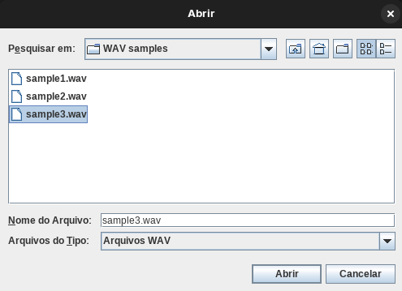
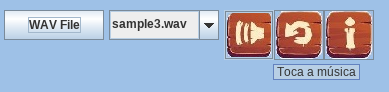
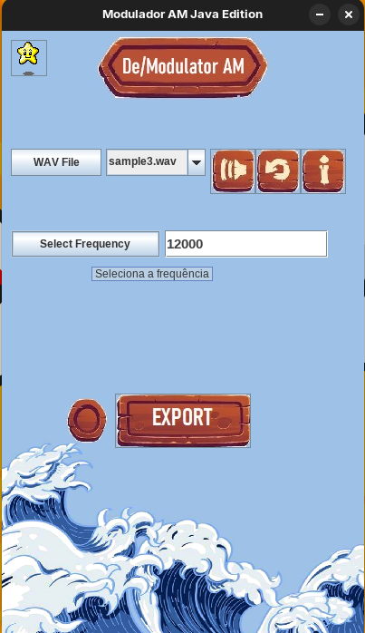
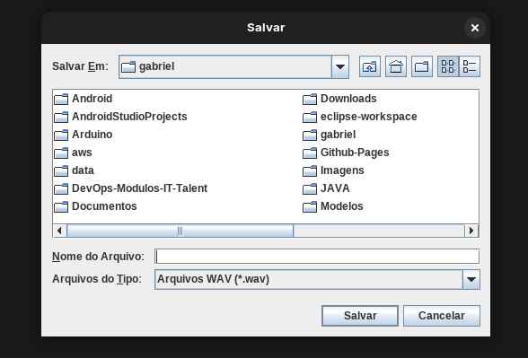
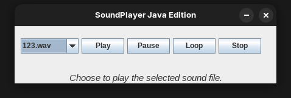

# Modulação e Demodulação AM usando Java Swing


### Sobre o projeto: 
Este projeto é uma aplicação com Modulação e Demodulação AM usando Java com Swing (GUI). Esse projeto foi criado na disciplina de Sinais e Sistemas na minha faculdade de engenharia de computação, como parte da ementa da disciplina.

O projeto consiste na Modulação de uma sinal sonoro, de acordo com uma frequência escolhida pelo usuário, através da Modulação AM. A modulação AM a princípio é o transporte de um sinal com um sinal de frequência muito mais alta, assim facilitando o transporte do nosso som. É como imaginar que queremos transportar nosso áudio, ele vai de ônibus até outro local, então modulamos o sinal com uma frequência alta (o transporte), e quando "chegamos" no destino ele é demodulado, e nosso audio volta ao normal.

Esse software tem muito mais peso pelo fator educativo do que o que realmente acontece no mundo real, pois na realidade usando frequências eletromagnéticas, que não é possível produzir por software.

### Estrutura de pastas
```
App/                      # Programa Compilado e Exportado para Linux e Windows
├── Linux/                # Linux Jar
│   └── [arquivos .jar]
├── Windows/              # Windows .exe
│   └── [arquivos .exe]

Java/                     
├── .settings/            # Arquivos de configurações do Eclipse IDE
│   └── [arquivos de configuração]
├── WAV samples/          # Exemplo de WAV para programa
│   └── [arquivos WAV]
├── bin/                  # Binários do programa
│   └── [arquivos binários]
├── res/                  # Recursos do programa
│   └── mod/              # Imagens e Gifs que são exportados
│       └── [arquivos de imagem e GIFs]
└── src/                  # Código fonte
    └── [arquivos .java]
```

### Como utilizar o software

A tela inicial ao executar o programa deve aparece o JDialogMessage como a imagem abaixo descreve:

<p align="center">
  
</p>

Na pasta src, temos uma pasta de arquivos .WAV, que foram disponibilizados para rodar nessa aplicação como exemplo, tendo em vista que só é possível rodar nativamente ,no Java Clip, arquivos de áudio do tipo .WAV,.AU ,.AIFF (com formato PCM 16bit).   
Você seleciona, com o botão, um áudio através do JChooseFiler no botao "WAV File".

<p align="center">
  
</p>

É possível tocar o Áudio (play) , dar um loop e você saber qual é as informações do áudio com os botões descritos abaixo:

<p align="center">
  
</p>

Selecionar uma frequência é essencial para poder exportar o áudio modulado, pois o codigo tem um Thread que fica checando se tem uma frequencia selecionada e um áudio tambem, so conseguindo exportar quando os dois estao preenchidos.
É muito importante saber que o mesmo valor de FREQUÊNCIA selecionada para modular tem que ser o mesmo para a frequência ao demodular.

<p align="center">
  
</p>

Ao exportar é checado o formato de áudio, se for um formato usado no Java Clip, ele ira mostrar o formato de áudio na tela sem erro algum.

<p align="center">
  
</p>

Escolher o nome do arquivo de áudio.

<p align="center">
  
</p>

Depois de exportar e salvar o áudio, é possível rodar um simples Soundplayer para tocar o áudio modulado, para poder escutar como o Áudio ficou.

<p align="center">
  
</p>

### Demodular:

Para demodular é o mesmo processo, seleciona o audio modulado e a mesma FREQUÊNCIA escolhida anteriormente, exporta e salva o arquivo. Assim você terá um áudio similar ao áudio inicial.


